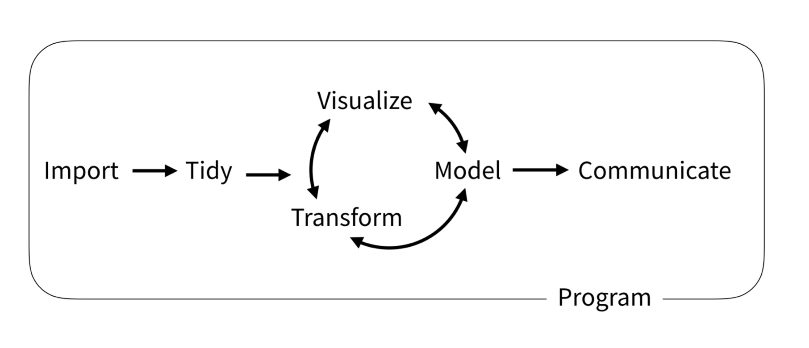

class: center, middle

```{r xaringan-themer, include = FALSE, warning = FALSE, purl = FALSE}
library(xaringanthemer)

style_mono_accent(base_color = "#002B54", 
                  title_slide_text_color = "#FFCB05",
                  header_font_google = google_font("Hind"),
                  text_font_google   = google_font("Hind"), 
                  code_font_size = "0.8rem")

extra_css <- list(
  ".ref" = list("font-size" = "75%", 
                "font-style" = "italic"),
  ".email" = list("font-size" = "65%", 
                  "font-style" = "italic", 
                  "color" = "white")
)

style_extra_css(css = extra_css)
```

class: center, middle
background-image: url("img/hexlogos.png")
background-size: 65%

---

# Typical tasks

```{r tasks, echo = FALSE, fig.align= "center", out.width = "75%", purl = FALSE} 

```

.ref[Wickham, H., Grolemund, G., 2016. R for Data Science, 1st ed. O’Reilly, Newton (USA).]

---

# Tidy data
1. Each **variable** forms a **column**.

2. Each **observation** forms a **row**.

3. Each type of observational unit forms a table.

.ref[Wickham, H., 2014. Tidy Data. Journal of Statistical Software 59, 1–23. https://doi.org/10.18637/jss.v059.i10]


```{r tidydata, echo = FALSE, fig.align= "center", out.width = "75%", purl = FALSE} 
knitr::include_graphics("img/tidydata.png")
```

.ref[Illustrations from the Openscapes blog Tidy Data for reproducibility, efficiency, and collaboration by Julia Lowndes and Allison Horst]

---

# Install and load

````{r install, eval = FALSE, purl = FALSE}
install.packages("tidyverse")
```

```{r load, message = TRUE, purl = TRUE}
library(tidyverse)
```

---

background-image: url("img/tidyverse.png")
background-position: 95% 10%
background-size: 25%

# Core packages

`readr` : Read rectangular data

`tibble` : Modern re-imagining of data frames

`stringr` : Functions to work with strings (i.e. sequence of characters)

`forcats` : Functions to modify factors (i.e. categorical data)

**`tidyr`** : Functions to tidy/reshape data

**`dplyr`** : Functions for data manipulation

**`purrr`** : Functional programming

**`ggplot2`** : Data visualization

---

# Pipe operator `%>%`

- `f(x)` is equivalent to `x %>% f`

- `f(x, y)` is equivalent to `x %>% f(y)`

- `f(y, x)` is equivalent to `x %>% f(y, .)`

```{r pipe, collapse = TRUE}
set.seed(42)
x <- runif(n = 10)

min(log(sort(x))) #<<

x %>% sort() %>% log() %>% min() #<<

set.seed(42)
10 %>% runif() %>% sort() %>% log() %>% min() #<<
```
