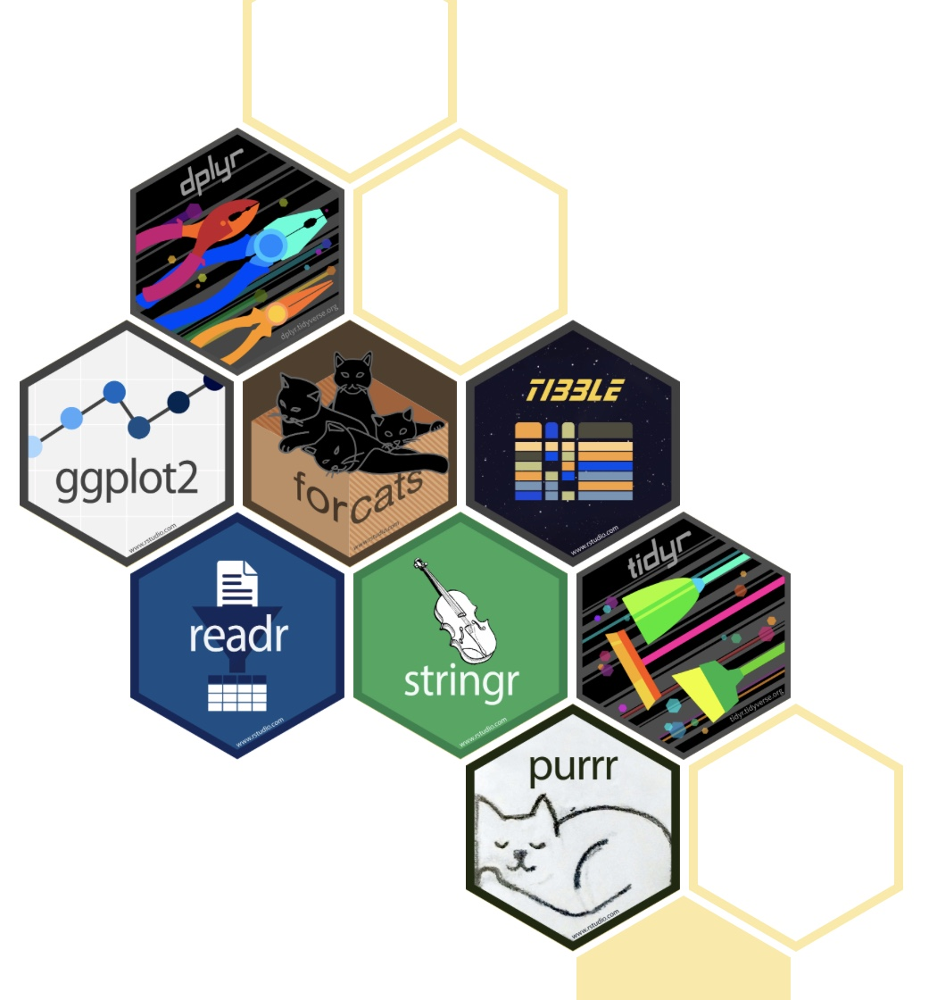
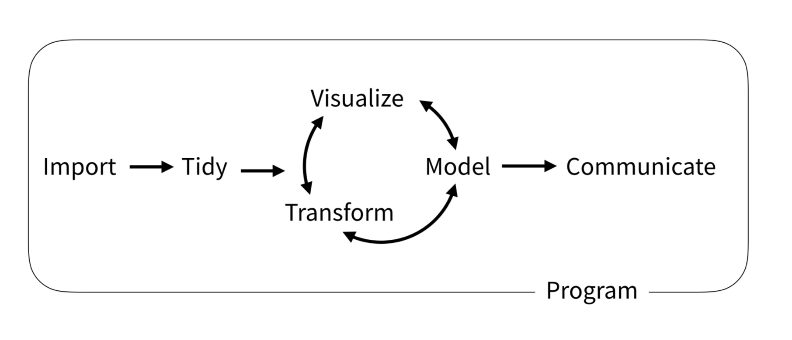
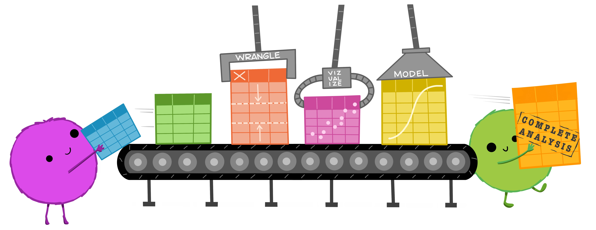
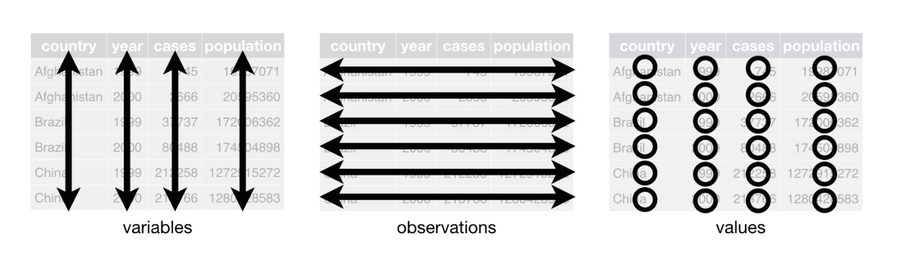

```{r xaringan-themer, include = FALSE, warning = FALSE}
library(xaringanthemer)

style_solarized_light(
  header_font_google = google_font("Josefin Sans"),
  text_font_google   = google_font("Josefin Sans")
  )

extra_css <- list(
  ".ref" = list("font-size" = "65%", "font-style" = "italic", "color" = "grey"),
  ".email" = list("font-size" = "65%", "font-style" = "italic", "color" = "white")
  )

style_extra_css(css = extra_css)
```

class: middle

# The _tidyverse_

.pull-left[
```{r hex, echo = FALSE, fig.align= "center", out.width = "75%"} 

```
.ref[www.tidyverse.org]
]

.pull-right[
```{r tasks, echo = FALSE, fig.align= "center", out.width = "100%"} 

```
.ref[Wickham, H., Grolemund, G., 2016. R for Data Science, 1st ed. O’Reilly, Newton (USA).]
]

---

# Tidy data

.ref[Wickham, H., 2014. Tidy Data. Journal of Statistical Software 59, 1–23. https://doi.org/10.18637/jss.v059.i10]

--

1. Each **variable** forms a **column**.

--

2. Each **observation** forms a **row**.

--

3. Each **value** must have its own **cell**.

--

```{r tidydata, echo = FALSE, fig.align= "center", out.width = "75%"} 

```

.ref[Illustration from the Openscapes blog Tidy Data for reproducibility, efficiency, and collaboration by Julia Lowndes and Allison Horst]

---

class: middle

# Tidy data

```{r table, echo = FALSE, fig.align= "center", out.width = "100%"} 

```

.ref[Wickham, H., Grolemund, G., 2016. R for Data Science, 1st ed. O’Reilly, Newton (USA).]

---

# Install and load

````{r install, eval = FALSE}
install.packages("tidyverse")
```

```{r load, message = TRUE}
library(tidyverse)
```

---

background-image: url("img/tidyverse.png")
background-position: 95% 10%
background-size: 25%

# Core packages

`readr` : Read rectangular data

`tibble` : Modern re-imagining of data frames

`stringr` : Functions to work with strings (i.e. sequence of characters)

`forcats` : Functions to modify factors (i.e. categorical data)

`tidyr` : Functions to tidy/reshape data

`dplyr` : Functions for data manipulation

`purrr` : Functional programming

`ggplot2` : Data visualization

---

background-image: url("img/maggritr.png")
background-position: 95% 10%
background-size: 10%

# Pipe operator `%>%`

--

- `f(x)` is equivalent to `x %>% f`

--

- `f(x, y)` is equivalent to `x %>% f(y)`

--

- `f(y, x)` is equivalent to `x %>% f(y, .)`

--

```{r pipe, collapse = TRUE}
set.seed(42)
x <- runif(n = 10)

min(log(sort(x))) #<<

x %>% sort() %>% log() %>% min() #<<

set.seed(42)
10 %>% runif() %>% sort() %>% log() %>% min() #<<
```

---

# Palmer penguins dataset

<!-- - `palmerpenguins` dataset -->

<!-- - Nesting observations, penguin size data, and isotope measurements from blood samples for adult Adélie, Chinstrap, and Gentoo penguins. -->

```{r penguins, echo = FALSE, fig.align= "center", out.width = "65%"}
knitr::include_graphics("img/penguins.png")
```

.ref[Horst A.M., Hill A.P., Gorman K.B., 2020. palmerpenguins: Palmer Archipelago (Antarctica) penguin data. R package version 0.1.0.]

---

background-image: url("img/readr.png")
background-position: 95% 10%
background-size: 10%

# Read data: _readr_

--

- Reads automatically into `tibble`

--

- Different `readr::read_*()` functions for different data types

--

- Functions to write data `readr::write_*()`

--

- `readxl` as alternative for Excel data

--

```{r readr, collapse = TRUE}
df_penguins <- readr::read_csv("data/penguins_raw.csv") %>% #<<
  magrittr::set_names(names(.) %>% stringr::str_remove_all(pattern = " ") %>% 
                        stringr::str_remove_all(pattern = "\\([^()]+\\)"))
```

---

background-image: url("img/tidyr.png")
background-position: 95% 10%
background-size: 10%

# Tidy data: _tidyr_

--

- Some functions to deal with `NA` values

```{r drop_na}
df_penguins <- tidyr::drop_na(df_penguins, BodyMass)
```

--

- `nest()`/`unnest()` to organize data

```{r nest}
tidyr::nest(df_penguins, data = -studyName)
```

--

- `pivot_longer()` & `pivot_wider()` most important functions to reshape data

---

background-image: url("img/dplyr.png")
background-position: 95% 10%
background-size: 10%

# Wrangle data: _dplyr_

--

- `filter()`: Subset rows; `select()`: Subset columns

```{r select_filter}
dplyr::filter(df_penguins, BodyMass >= quantile(BodyMass, 0.75), Sex != "FEMALE") %>% 
  dplyr::select_if(is.numeric) %>% head(5)
```

--

- `pull()`: Convert one column as vector

```{r pull}
dplyr::pull(df_penguins, FlipperLength) %>% head(10)
```

---

background-image: url("img/dplyr.png")
background-position: 95% 10%
background-size: 10%

# Wrangle data: _dplyr_

mutate case_when

---

background-image: url("img/dplyr.png")
background-position: 95% 10%
background-size: 10%

# Wrangle data: _dplyr_

group_by and summarize

---

background-image: url("img/dplyr.png")
background-position: 95% 10%
background-size: 10%

# Wrangle data: _dplyr_

joins

---

background-image: url("img/purrr.png")
background-position: 95% 10%
background-size: 10%

# Functional programming: _purrr_

map
