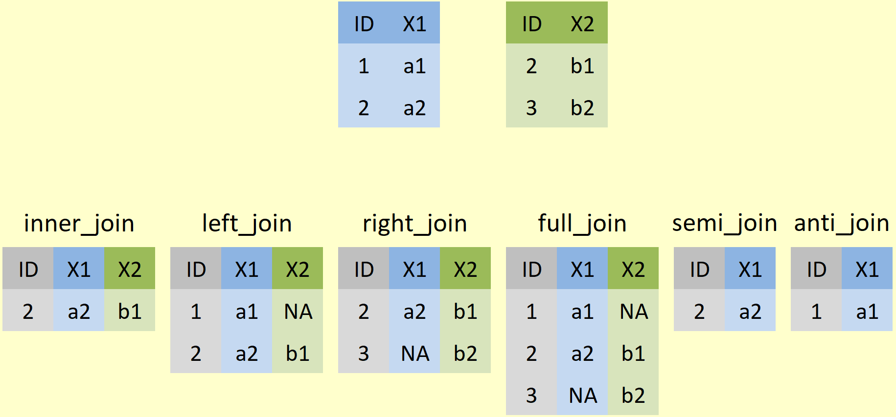

```{r xaringan-themer, include = FALSE, warning = FALSE}
library(xaringanthemer)

xaringanthemer::style_duo(
  header_font_google = google_font("Abril Fatface"),
  text_font_google   = google_font("Montserrat"), # Ubuntu
  
  background_color = "#E0FEFF", text_color = "#000000",
  primary_color = "#E0FEFF", secondary_color = "#FD6467", 
  link_color = "#000000", colors = c(yellow = "#CEAB07")
)

extra_css <- list(
  ".ref" = list("font-size" = "65%", "font-style" = "italic")
)

style_extra_css(css = extra_css)
```

class: inverse, center, middle
background-image: url("img/tidyverse.png")
background-position: 95% 95%
background-size: 25%

# Using the _tidyverse_

### Maximilian H.K. Hesselbarth

#### University of Michigan (EEB)

2022-03-25

---

# The _tidyverse_

.pull-left[

```{r hex, echo = FALSE, fig.align= "center", out.width = "75%"} 
knitr::include_graphics("img/hexlogos.png")
```

.ref[www.tidyverse.org]

]

.pull-right[

```{r tasks, echo = FALSE, fig.align= "center", out.width = "100%"} 
knitr::include_graphics("img/tasks.png")
```

.ref[Wickham, H., Grolemund, G., 2016. R for Data Science, 1st ed. O’Reilly, Newton (USA).]

]

---

# Tidy data

--

1. Each **variable** forms a **column**.

--

2. Each **observation** forms a **row**.

--

3. Each **value** must have its own **cell**.

.ref[Wickham, H., 2014. Tidy Data. Journal of Statistical Software 59, 1–23. https://doi.org/10.18637/jss.v059.i10]

--

```{r tidydata, echo = FALSE, fig.align= "center", out.width = "75%"} 
knitr::include_graphics("img/tidydata.png")
```

.ref[Illustration from the Openscapes blog Tidy Data for reproducibility, efficiency, and collaboration by Julia Lowndes and Allison Horst]

---

# Tidy data

```{r table, echo = FALSE, fig.align= "center", out.width = "100%"} 
knitr::include_graphics("img/table.png")
```

.ref[Wickham, H., Grolemund, G., 2016. R for Data Science, 1st ed. O’Reilly, Newton (USA).]

---

# Install and load

````{r install, eval = FALSE}
install.packages("tidyverse")
```

```{r load, message = TRUE}
library(tidyverse)
```

---

background-image: url("img/tidyverse.png")
background-position: 95% 10%
background-size: 25%

# Core packages

`readr`   : Read rectangular data

`tibble`  : Modern re-imagining of data frames

`stringr` : Functions to work with strings (i.e. sequence of characters)

`forcats` : Functions to modify factors (i.e. categorical data)

`tidyr`   : Functions to tidy/reshape data

`dplyr`   : Functions for data manipulation

`purrr`   : Functional programming

`ggplot2` : Data visualization

---

background-image: url("img/maggritr.png")
background-position: 95% 10%
background-size: 10%

# Pipe operator `%>%`

--

- `f(x)` is equivalent to `x %>% f`

--

- `f(x, y)` is equivalent to `x %>% f(y)`

--

- `f(y, x)` is equivalent to `x %>% f(y, .)`

--

```{r pipe, collapse = TRUE}
set.seed(42)
x <- runif(n = 10)

min(log(sort(x))) #<<

x %>% sort() %>% log() %>% min() #<<

set.seed(42)
10 %>% runif() %>% sort() %>% log() %>% min() #<<
```

---

class: inverse

# Palmer penguins dataset

<!-- - `palmerpenguins` dataset -->

<!-- - Nesting observations, penguin size data, and isotope measurements from blood samples for adult Adélie, Chinstrap, and Gentoo penguins. -->

```{r penguins, echo = FALSE, fig.align= "center", out.width = "65%"}
knitr::include_graphics("img/penguins.png")
```

.ref[Horst A.M., Hill A.P., Gorman K.B., 2020. palmerpenguins: Palmer Archipelago (Antarctica) penguin data. R package version 0.1.0.]

---

background-image: url("img/readr.png")
background-position: 95% 10%
background-size: 10%

# Read data: _readr_

--

- Reads automatically into `tibble`

--

- Different `readr::read_*()` functions for different data types

--

- Functions to write data `readr::write_*()`

--

- `readxl` as alternative for Excel data

--

```{r readr, collapse = TRUE}
df_penguins <- readr::read_csv("data/penguins_raw.csv") %>% #<<
  magrittr::set_names(names(.) %>% stringr::str_remove_all(pattern = " ") %>% 
                        stringr::str_remove_all(pattern = "\\([^()]+\\)") %>% 
                        stringr::str_to_lower())
```

---

background-image: url("img/tidyr.png")
background-position: 95% 10%
background-size: 10%

# Tidy data: _tidyr_

--

- `pivot_longer()` & `pivot_wider()` most important functions to **reshape** data

  .yellow[(I will come back to this later!)]

--

- Some functions to deal with `NA` values

```{r drop_na}
df_penguins <- tidyr::drop_na(df_penguins, bodymass)
```

--

- `nest()`/`unnest()` to organize data

```{r nest}
tidyr::nest(df_penguins, data = -island)
```

---

background-image: url("img/dplyr.png")
background-position: 95% 10%
background-size: 10%

# Wrangle data: _dplyr_

--

- `filter()` to subset **rows**; `select()` to subset **columns**

--

```{r select_filter}
dplyr::filter(df_penguins, bodymass >= quantile(bodymass, 0.75), sex != "FEMALE") %>% #<<
  dplyr::select_if(is.numeric) %>% #<<
  head(5)
```

--

- `pull()` to convert **one** column as vector

```{r pull}
dplyr::pull(df_penguins, flipperlength) %>% #<<
  head(10)
```

---

background-image: url("img/dplyr.png")
background-position: 95% 10%
background-size: 10%

# Wrangle data: _dplyr_

--

- `mutate()` to **create/modify** columns

- `case_when()` as vectorised **ifelse** statements

- `slice()` to subset **rows** by position

--

```{r mutate}
dplyr::select(df_penguins, individualid, species, culmenlength) %>%
  dplyr::mutate(culmenlength_cm = culmenlength / 10, #<<
                culmenlenth_class = 
                  dplyr::case_when(culmenlength < 35  ~ "small", #<<
                                   culmenlength >= 35 & culmenlength <= 45 ~ "med", 
                                   culmenlength > 45 ~ "large")) %>%
  dplyr::slice(sample(1:nrow(.), size = 3))
```

---

background-image: url("img/dplyr.png")
background-position: 95% 10%
background-size: 10%

# Wrangle data: _dplyr_

--

- `group_by()` to group by **column**

- `summarise()` to **summarize** each group

- `n()` to **count** observations within each group (context dependent)

--

```{r group_by}
(df_penguins_sum <- dplyr::group_by(df_penguins, island, species) %>% #<<
  dplyr::summarise(n = dplyr::n(), #<<
                   flipperlength_mn = mean(flipperlength), 
                   flipperlength_sd = sd(flipperlength), 
                   .groups = "drop")) #<<
```

---

background-image: url("img/dplyr.png")
background-position: 95% 10%
background-size: 10%

# Wrangle data: _dplyr_

--

- `*_join()` to combine columns from `x` and `y` using matching **keys**

--

```{r join}
dplyr::left_join(x = df_penguins, y = df_penguins_sum, by = c("island", "species")) %>% #<<
  dplyr::select(species, island, tidyselect::starts_with("flipper")) %>% 
  dplyr::slice(sample(1:nrow(.), size = 5))
```

---

background-image: url("img/dplyr.png")
background-position: 95% 10%
background-size: 10%

# Wrangle data: _dplyr_

```{r joing_fig, echo = FALSE, fig.align= "center", out.width = "75%"} 

```

.ref[https://statisticsglobe.com/r-dplyr-join-inner-left-right-full-semi-anti]

---

background-image: url("img/tidyr.png")
background-position: 95% 10%
background-size: 10%

# Tidy data: _tidyr_

--

- Create summarized `data.frame` with mean bodymass for each species, island, year

--

```{r sum_pivot}
(df_pen_sum <- dplyr::mutate(df_penguins, year = format(dateegg, "%Y"),
                             species = stringr::str_split(df_penguins$species, 
                                pattern = " ", simplify = TRUE)[, 1]) %>% 
  dplyr::group_by(species, island, year) %>% 
  dplyr::summarise(bodymass = mean(bodymass), .groups = "drop") %>% 
  dplyr::filter(year %in% c(2007, 2009))) #<<
```

---

background-image: url("img/tidyr.png")
background-position: 95% 10%
background-size: 10%

# Tidy data: _tidyr_

--

- Reshape from **long** to **wide** specifying column names and values

--

```{r pivot_wider}
(df_pen_wide <- tidyr::pivot_wider(df_pen_sum, 
                                   names_from = year, values_from = bodymass, #<<
                                   names_prefix = "yr_") %>%
   dplyr::mutate(diff = (yr_2009 - yr_2007) / yr_2007 * 100))
```

---

background-image: url("img/tidyr.png")
background-position: 95% 10%
background-size: 10%

# Tidy data: _tidyr_

--

- Reshape from **wide** to **long** specifying which columns _not_ to reshape

--

```{r pivot_longer}
tidyr::pivot_longer(df_pen_wide, -c(species, island), #<<
                    names_to = "years", values_to = "bodymass") %>% 
  head(10)
```

---

background-image: url("img/purrr.png")
background-position: 95% 10%
background-size: 10%

# Functional programming: _purrr_

--

- `map_*()` to apply function to each element (vector/list)

--

```{r map}
species_names <- unique(df_penguins$species)
purrr::map(species_names, function(i) { #<<
  dplyr::filter(df_penguins, species == i) %>% dplyr::pull(island) %>% 
    unique() %>% stringr::str_sort() %>% paste(collapse = ", ")})
```

--

```{r map_int} 
foo <- function(i) {dplyr::filter(df_penguins, species == i) %>%
    dplyr::pull(island) %>% unique %>% length}
purrr::map_int(species_names, foo) #<<
```

---

background-image: url("img/purrr.png")
background-position: 95% 10%
background-size: 10%

# Functional programming: _purrr_

--

- `reduce_*()` to **remove** a list by one level

--

```{r reduce, message=FALSE}
pick <- c("culmenlength", "culmendepth", "flipperlength")
foo <- function(i, j) {df <- dplyr::select(i, studyname, bodymass, j)
cor(df[, 2], df[, 3]) %>% dplyr::bind_cols(study = unique(df$studyname), .)
}

dplyr::group_by(df_penguins, island) %>% dplyr::group_split() %>% 
  purrr::map2(pick, foo) %>% #<<
  purrr::reduce(left_join, by = "study") #<<
```

---

class: inverse

## Thank you for your attention

### Questions? 

.pull-left[

Further resources: [https://mhesselbarth.github.io/advanced-r-workshop/resources](https://mhesselbarth.github.io/advanced-r-workshop/resources)

Exercise: [https://mhesselbarth.github.io/advanced-r-workshop/exercise_tidyverse](https://mhesselbarth.github.io/advanced-r-workshop/exercise_tidyverse)

]

.pull-right[

Add contacts

]
